# AURA Voice Agent — n8n Automation Architecture

**Status:** Planning document — Phase 2 (n8n integration), not yet built **Scope:** 7 personas, 1 shared Google Calendar, Zoho SMTP notifications, Oracle Cloud single-VM hosting **Companion to:** core-behavior.md, persona JSON schema v2.0.0, N8nClient.ts contract

---

## 1. System Overview

How a caller's words become a real calendar event, end to end.

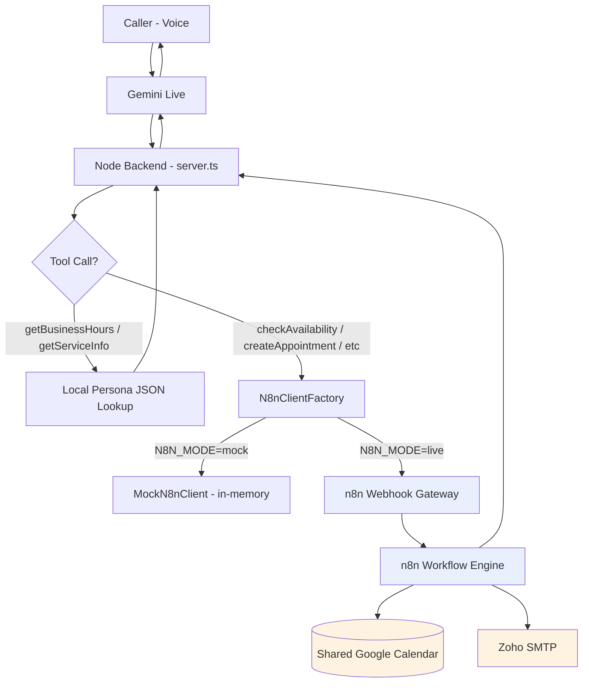

**Key invariant:** the Node backend never talks to Google Calendar or Zoho directly. n8n is the only component with those credentials. The app only ever calls n8n's webhook, authenticated by a shared secret header.

---

## 2. Component Responsibility Map

| Component | Owns | Never does |
| --- | --- | --- |
| Gemini Live | Conversation, intent, speech | Dates, prices, calendar truth |
| Node backend (`server.ts` + tools) | Session state, persona truth, tool dispatch, date resolution | Talk to Google/Zoho directly |
| n8n | Calendar reads/writes, email sending, idempotency, booking locks | Conversation logic, persona personality |
| Google Calendar (shared) | Single source of truth for all bookings, all 7 personas | — |
| Zoho SMTP | Transactional email only | — |

---

## 3. The Shared Calendar Data Model

One calendar, `personaId` + `resourceId` carried as **private extended properties** on every event (visible only to the calendar owner — n8n's service account — never to any attendee).

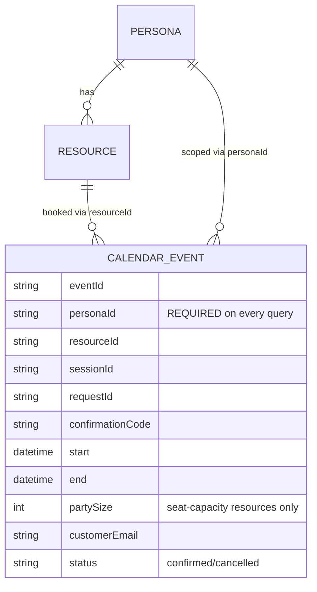

**Hard rule, enforced structurally:** every `events.list` call against this calendar uses Google's `privateExtendedProperty` server-side filter with `personaId=<x>` as a mandatory, non-optional parameter. This lives in one shared sub-workflow (§4, node 02) that every other workflow calls through — it is not re-implemented per workflow, so it cannot be accidentally skipped.

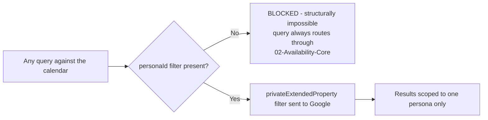

---

## 4. Workflow Map

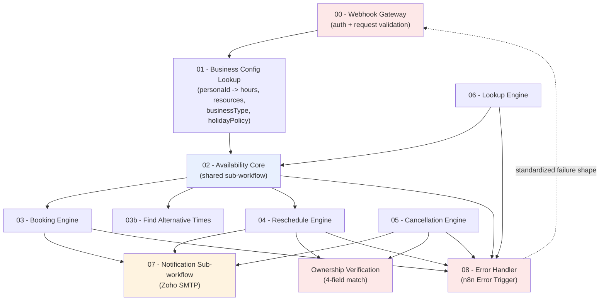

Nothing calls Google Calendar directly except `02 - Availability Core`, `03 - Booking Engine`, `04 - Reschedule Engine`, `05 - Cancellation Engine`, and `06 - Lookup Engine` — and all of them route their *reads* through 02 so the `personaId` filter rule in §3 is enforced in exactly one place.

---

## 5. checkAvailability — Full Sequence

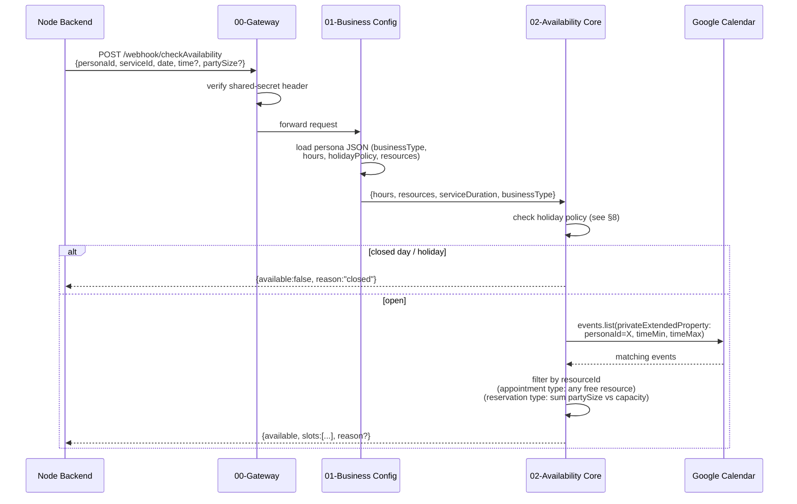

---

## 6. createAppointment — Full Sequence (the critical path)

This is the workflow where the earlier "false email claim" bug lived — the diagram makes the fix structural, not just a prompt instruction.

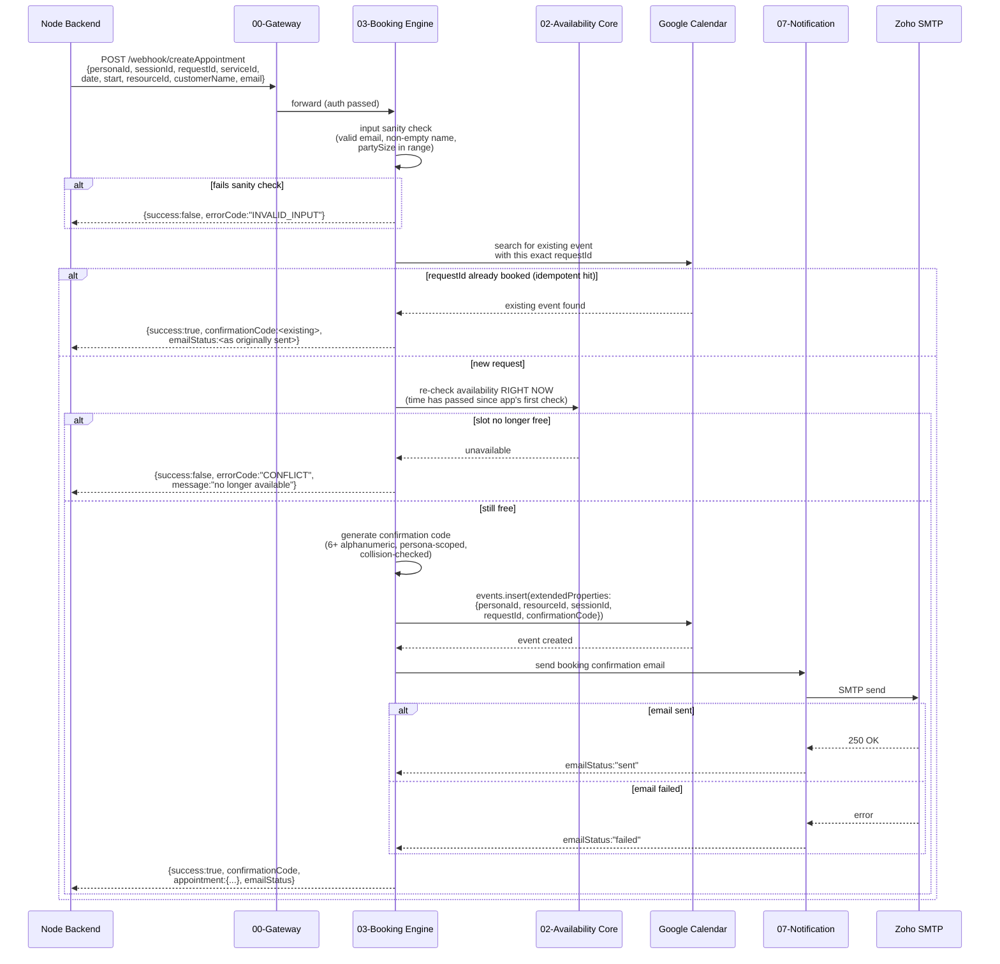

**Why `emailStatus` is on the critical path, not a side note:** the app's `PromptComposer` reads this field to decide whether the agent is *allowed* to say "I've sent a confirmation to your email." If n8n ever returns success without `emailStatus`, the safest default on the app side is to treat it as `"not_configured"` — never assume `"sent"`.

---

## 7. Reschedule / Cancel — Ownership Verification (4-field, fail-closed)

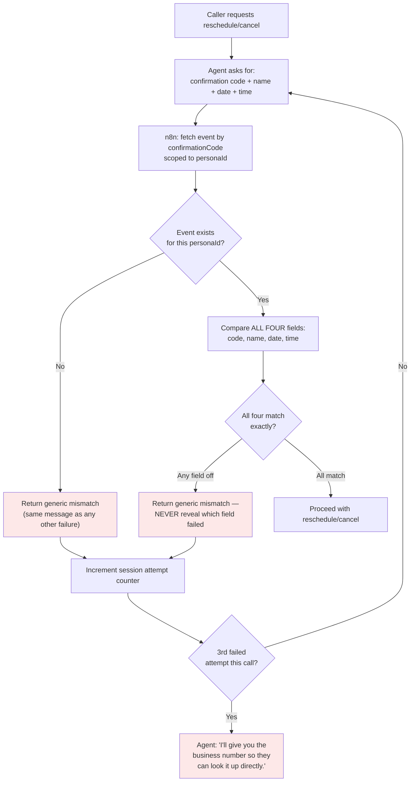

The "never reveal which field failed" rule is enforced at the n8n level — the workflow returns one shape (`{matched:false}`) regardless of *which* comparison failed, so there's no field in the response for the app or the model to accidentally leak.

---

## 8. Holiday & BusinessType Decision Logic

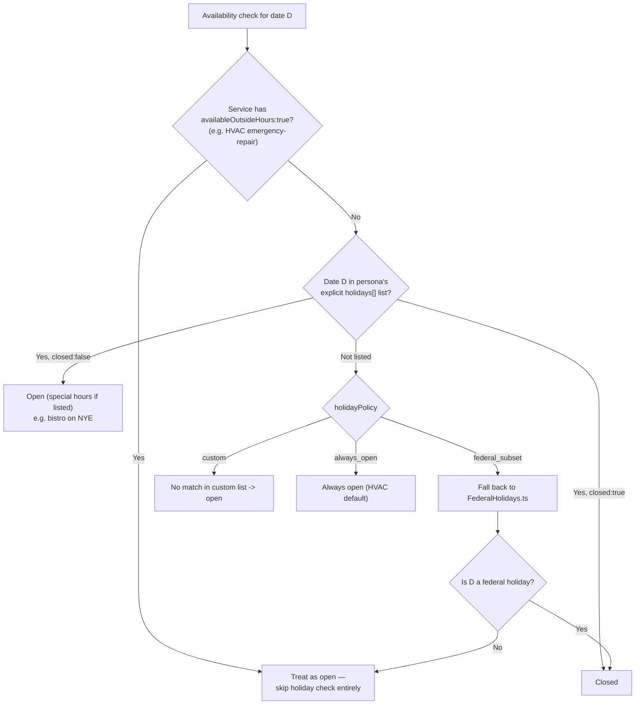

| businessType | Capacity model | Typical holidayPolicy | Emergency override |
| --- | --- | --- | --- |
| `appointment` (salon, dental, auto, legal) | 1 resource = 1 booking | `federal_subset` | No |
| `reservation` (bistro) | Sum `partySize` vs. seat capacity | `custom` (closed Christmas/Thanksgiving, open NYE) | No |
| `consultation` (realty) | 1 resource = 1 booking, often complimentary | `custom` (weekends often open) | No |
| `dispatch` (HVAC) | 1 resource = 1 booking + always-on emergency pool | `custom` | Yes — `availableOutsideHours` bypasses holiday check |

The engine never branches on `personaId` by name — only on `businessType` and the declared JSON fields. Adding an 8th persona later is a config change, not a code change.

---

## 9. Concurrency & Locking

Two different personas booking the same clock time must never interfere — and two requests for the *same* persona+resource+slot must never double-book.

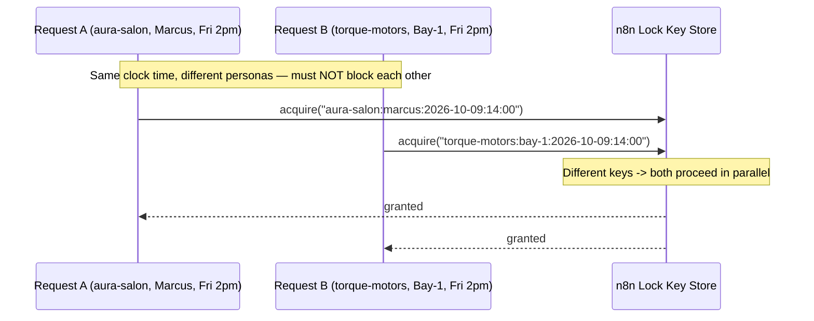

**Lock key format:** `{personaId}:{resourceId}:{date}:{time}` — never just `{date}:{time}`. This is a one-line implementation detail with an outsized consequence if missed: without `personaId` and `resourceId` in the key, unrelated personas would serialize behind each other during concurrent demo calls.

---

## 10. Spam / Off-Topic Handling (conversational layer)

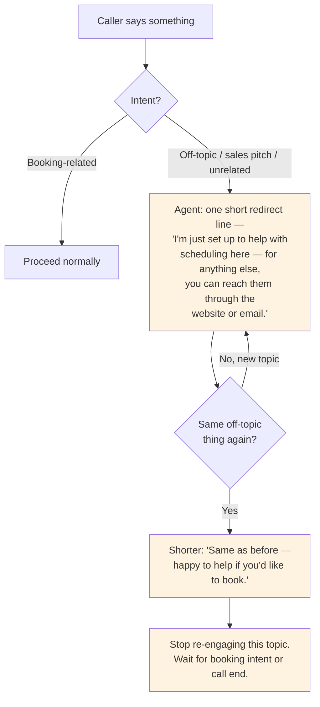

This logic lives entirely in `core-behavior.md` (new §11) — it is identical across all 7 personas and needs no n8n involvement, since it never reaches a tool call.

---

## 11. Abuse Protection (system layer, separate from conversational spam)

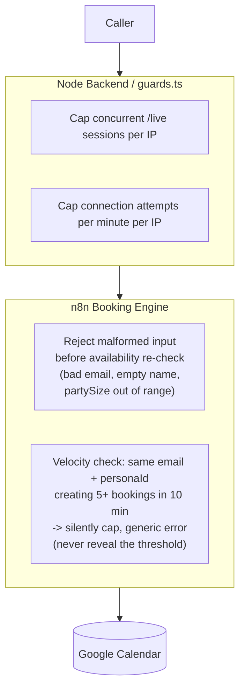

---

## 12. Error Response Contract

Every workflow that can fail returns the **same shape**, so the app never has to guess:

```json
{
  "success": false,
  "errorCode": "CONFLICT | INVALID_INPUT | NOT_FOUND | RATE_LIMITED | UPSTREAM_ERROR",
  "message": "human-readable, safe to read aloud or adapt"
}
```

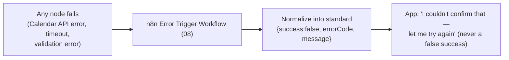

---

## 13. Security Layering

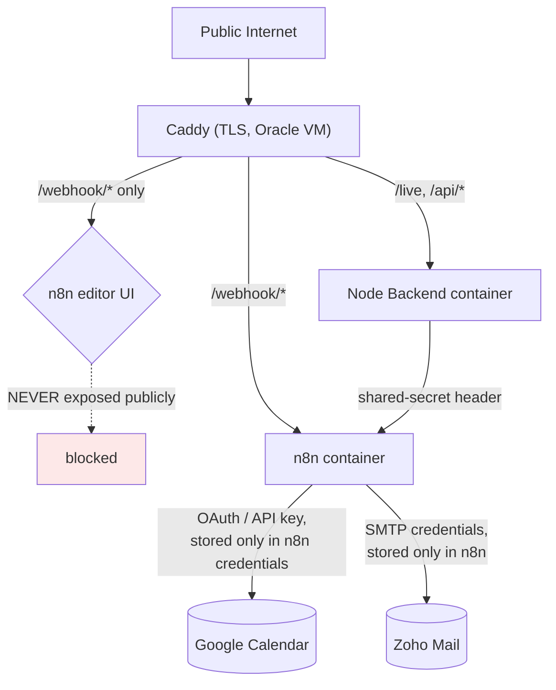

Both containers (app + n8n) run on the same Oracle Ampere VM, same Docker network — the webhook call never leaves the machine.

---

## 14. Open Items Before Build

These are the only remaining decisions, everything else in this document is locked:

1. **Lock-store implementation** — in-memory inside n8n (simplest, fine for single-VM demo) vs. a tiny Postgres/Redis table if you want locks to survive an n8n restart mid-booking.
2. **Velocity-check storage** — same choice as above; a lightweight key-value store inside n8n is enough for a demo volume.
3. **Confirmation code generation location** — this document assumes n8n generates it (§6), replacing the mock's generator. Confirm that's still correct now that n8n owns the calendar.

Once these three are confirmed, the next document is the literal per-workflow JSON contract (request/response schema, node-by-node) ready to hand to whoever builds the actual n8n workflows.